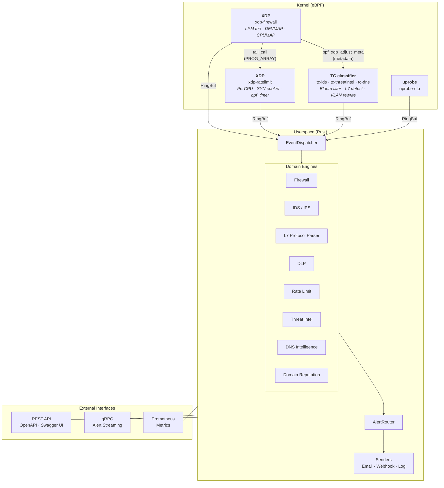

# eBPFsentinel

High-performance network security agent powered by eBPF. Written entirely in Rust (kernel programs + userspace) using the [Aya](https://aya-rs.dev/) framework.

## Features

| Domain                  | Description                                                                                                                                                                                                                                                                    | eBPF Program    |
| ----------------------- | ------------------------------------------------------------------------------------------------------------------------------------------------------------------------------------------------------------------------------------------------------------------------------ | --------------- |
| **Firewall**            | L3/L4 packet filtering with LPM trie CIDR matching (O(log n)), port ranges, priority-based first-match-wins, tail-call chaining to rate limiter, FIB routing enrichment, packet mirroring via `DEVMAP`, CPU steering via `CPUMAP`, IPv4/IPv6 dual-stack, 802.1Q VLAN filtering | XDP             |
| **IDS**                 | Intrusion detection with regex pattern matching, kernel-side sampling (`bpf_get_prandom_u32`), L7 protocol detection (`bpf_strncmp`), threshold detection, RingBuf backpressure                                                                                                | TC classifier   |
| **IPS**                 | Intrusion prevention with automatic IP blacklisting, sampling and threshold support                                                                                                                                                                                            | Shared with IDS |
| **DLP**                 | Data loss prevention with configurable pattern scanning                                                                                                                                                                                                                        | uprobe (SSL)    |
| **Rate Limiting**       | DDoS protection with 5 algorithms (token bucket, fixed window, sliding window, leaky bucket, SYN cookie), per-CPU lock-free buckets, kernel-side timer maintenance                                                                                                             | XDP             |
| **Threat Intelligence** | OSINT feed integration with Bloom filter pre-check, IOC correlation, VLAN quarantine action, IPv4/IPv6 dual-stack                                                                                                                                                              | TC classifier   |
| **L7 Firewall**         | Application-layer filtering with protocol-aware rules for HTTP, TLS/SNI, gRPC, SMTP, FTP, and SMB traffic                                                                                                                                                                      | Userspace       |
| **DNS Intelligence**    | Passive DNS capture, domain↔IP cache, domain blocklists with feed integration                                                                                                                                                                                                 | TC classifier   |
| **Domain Reputation**   | Behavioral scoring engine, auto-blocking, alert enrichment with domain context                                                                                                                                                                                                 | Userspace       |

Additional capabilities:

- **IPv6 + VLAN 802.1Q** dual-stack support across all eBPF programs and domain engines
- **IDS/IPS Sampling** with random and hash-based modes — kernel-side (`bpf_get_prandom_u32`) and userspace
- **IDS/IPS Threshold Detection** with per-rule limit, threshold, and combined modes
- **L7 Protocol Detection** in eBPF via `bpf_strncmp` (HTTP, TLS, SSH signature matching)
- **LPM Trie CIDR Matching** for O(log n) firewall source/destination subnet lookups
- **XDP Tail-Call Chaining** — firewall → rate limiter via `PROG_ARRAY` (single attach point)
- **XDP→TC Metadata Passing** via `bpf_xdp_adjust_meta` (rule ID, rate limit status forwarded to TC programs)
- **RingBuf Adaptive Backpressure** via `bpf_ringbuf_query` (skip event emission when buffer >75% full)
- **Suspend-Aware Timestamps** via `bpf_ktime_get_boot_ns` (accurate across sleep/hibernate)
- **Per-CPU Flow Tracking** with `bpf_get_socket_cookie` for connection correlation
- **Packet Mirroring** via `DEVMAP` + `bpf_redirect` to monitoring interfaces
- **CPU Steering** via `CPUMAP` for NUMA-aware packet distribution
- **FIB Routing Enrichment** via `bpf_fib_lookup` for next-hop and routing anomaly detection
- **MTU Validation** via `bpf_check_mtu` before packet redirect operations
- **Kernel-Side Maintenance** via `bpf_timer` for periodic bucket expiration and cleanup
- **SYN Cookie Protection** via `bpf_tcp_gen_syncookie` for SYN flood mitigation at XDP speed
- **VLAN Rewriting** via `bpf_skb_vlan_push/pop` for quarantine VLAN tagging
- **Checksum Offload** via `bpf_csum_diff` / `bpf_l3_csum_replace` / `bpf_l4_csum_replace`
- **System Metrics** with process memory, CPU, and bytes-processed tracking
- **Alert Pipeline** with circuit breaker, deduplication, and routing to email/webhook/log sinks
- **Audit Trail** with rule change history and retention policies
- **Hot Reload** of configuration and rules without restart (SIGHUP, file watcher, or REST API trigger)
- **REST API** (Axum) with OpenAPI 3.0, Swagger UI, and operational endpoints (config reload, eBPF status)
- **gRPC Streaming** (tonic) for real-time alert subscriptions
- **JWT/OIDC Authentication** with role-based access control and static API keys
- **TLS 1.3** via rustls for both REST and gRPC
- **Prometheus Metrics** with per-domain counters, histograms, gauges, and system-level metrics

## Architecture



Hexagonal/DDD architecture with strict dependency rules:

| Crate            | Role                                    | Depends on        |
| ---------------- | --------------------------------------- | ----------------- |
| `domain`         | Business logic, engines, entities       | Nothing           |
| `ports`          | Trait definitions (primary + secondary) | `domain`          |
| `application`    | Use cases, pipelines, orchestration     | `domain`, `ports` |
| `infrastructure` | Config, logging, metrics                | `domain`, `ports` |
| `adapters`       | HTTP, gRPC, eBPF, storage (redb)        | `domain`, `ports` |
| `agent`          | Binary entry point, startup             | All crates        |

## Quick start

### Prerequisites

- Linux kernel 5.17+ with BTF support (`bpf_loop`, `bpf_strncmp`, Bloom filter maps, LPM tries)
- Rust stable (userspace) + Rust nightly with `rust-src` (eBPF programs)
- `bpftool`, `iproute2` (runtime)

Verify kernel support:

```bash
uname -r                           # >= 5.17
ls /sys/kernel/btf/vmlinux         # BTF must exist
```

### Build from source

```bash
# Build userspace agent
cargo build --release

# Build eBPF kernel programs (requires nightly)
cargo xtask ebpf-build

# Run (requires root for eBPF)
sudo ./target/release/ebpfsentinel-agent --config config/ebpfsentinel.yaml
```

### Docker

```bash
# Build image
docker build -t ebpfsentinel .

# Run (privileged + host network required for eBPF)
docker run --privileged --network host \
  -v ./config:/etc/ebpfsentinel \
  ebpfsentinel
```

### Docker Compose

```bash
# Edit config/ebpfsentinel.yaml with your interfaces
docker compose up -d

# View logs
docker compose logs -f

# Stop
docker compose down
```

## Configuration

Single YAML file. Only `agent.interfaces` is required.

**Precedence:** CLI flags > environment variables > YAML file > defaults

### Minimal

```yaml
agent:
  interfaces: [eth0]
```

### Full reference

See [`config/ebpfsentinel.example.yaml`](config/ebpfsentinel.example.yaml) for all options with comments.

### Key sections

| Section       | Description                                                                                                                                   |
| ------------- | --------------------------------------------------------------------------------------------------------------------------------------------- |
| `agent`       | Interfaces, ports, log level/format                                                                                                           |
| `firewall`    | L3/L4 rules with priority (first-match-wins), CIDR subnets, port ranges, wildcards, default policy (pass/drop), VLAN ID, IPv4/IPv6 dual-stack |
| `ids`         | Intrusion detection mode (alert/block), sampling, threshold detection                                                                         |
| `ips`         | Intrusion prevention mode, blacklist management, sampling, threshold detection                                                                |
| `dlp`         | Data loss prevention patterns and mode                                                                                                        |
| `l7`          | Application-layer firewall rules: protocol (HTTP/TLS/gRPC/SMTP/FTP/SMB), matchers, priority-based first-match-wins                            |
| `ratelimit`   | Per-IP rate limiting with 5 algorithms (token bucket, fixed/sliding window, leaky bucket, SYN cookie), per-CPU lock-free buckets              |
| `threatintel` | OSINT feed URLs, formats, field mappings, refresh intervals                                                                                   |
| `dns`         | DNS cache sizing, domain blocklists (inline + feeds), reputation scoring                                                                      |
| `alerting`    | Alert routing, email/webhook senders, circuit breaker                                                                                         |
| `audit`       | Audit trail retention, storage paths                                                                                                          |
| `tls`         | TLS certificate and key paths                                                                                                                 |
| `auth`        | JWT issuer/audience, OIDC discovery URL, RBAC roles                                                                                           |

### Per-feature examples

The [`config/examples/`](config/examples/) directory contains standalone configuration files for each feature:

| File                                                   | Feature          | Description                                                                 |
| ------------------------------------------------------ | ---------------- | --------------------------------------------------------------------------- |
| [`firewall.yaml`](config/examples/firewall.yaml)       | Firewall         | L3/L4 rules, LPM trie CIDR, port ranges, VLAN, IPv6, tail-call chaining     |
| [`ids.yaml`](config/examples/ids.yaml)                 | IDS              | Rules, kernel-side sampling, L7 detection, threshold, domain-aware matching |
| [`ips.yaml`](config/examples/ips.yaml)                 | IPS              | Blacklist config, whitelist, auto-threshold, rules with block mode          |
| [`dlp.yaml`](config/examples/dlp.yaml)                 | DLP              | Credit card, SSN, API key, JWT, email patterns with per-pattern mode        |
| [`l7.yaml`](config/examples/l7.yaml)                   | L7 Firewall      | HTTP, TLS/SNI, gRPC, SMTP, FTP, SMB protocol-aware rules                    |
| [`ratelimit.yaml`](config/examples/ratelimit.yaml)     | Rate Limiting    | 5 algorithms (incl. SYN cookie), per-CPU buckets, kernel-side maintenance   |
| [`threatintel.yaml`](config/examples/threatintel.yaml) | Threat Intel     | CSV, JSON, STIX feeds, Bloom filter pre-check, VLAN quarantine action       |
| [`dns.yaml`](config/examples/dns.yaml)                 | DNS Intelligence | Cache tuning, inline blocklist, external feeds, reputation scoring          |
| [`alerting.yaml`](config/examples/alerting.yaml)       | Alerting         | SMTP email, webhook, log routes, dedup, throttle                            |
| [`audit.yaml`](config/examples/audit.yaml)             | Audit Trail      | Retention, buffer size, storage path                                        |
| [`auth.yaml`](config/examples/auth.yaml)               | Authentication   | API keys, JWT (RS256), OIDC (JWKS), roles, namespace scoping                |
| [`tls.yaml`](config/examples/tls.yaml)                 | TLS              | Certificate and key paths for REST + gRPC                                   |

Each file is a standalone, valid configuration — copy one and customize it for your deployment.

### Firewall rule matching

The XDP firewall uses a **two-phase lookup** for optimal performance:

1. **LPM Trie phase** (O(log n)) — CIDR-only rules (source/destination subnet) are loaded into `LPM_TRIE` maps for fast longest-prefix-match lookups. Four tries cover: `FW_LPM_SRC_V4`, `FW_LPM_DST_V4`, `FW_LPM_SRC_V6`, `FW_LPM_DST_V6`.
2. **Linear scan phase** — rules with port ranges, protocol, or VLAN filters are evaluated in priority order (lowest priority number = highest precedence). The first matching rule wins.

Each rule field is optional (wildcard). Only fields with a value are checked:

| Field      | Wildcard behavior  | Match logic                           |
| ---------- | ------------------ | ------------------------------------- |
| `src_ip`   | Omit to match any  | CIDR subnet match (`10.0.0.0/8`)      |
| `dst_ip`   | Omit to match any  | CIDR subnet match (`192.168.1.0/24`)  |
| `src_port` | Omit to match any  | Port range match (`1024-65535`)       |
| `dst_port` | Omit to match any  | Port range match (`80-443`) or single |
| `protocol` | `any` to match all | Exact match (`tcp`, `udp`, `icmp`)    |
| `vlan_id`  | Omit to match any  | Exact 802.1Q VLAN ID match            |

**Default policy** (`default_policy: pass` or `drop`) is applied when no rule matches. Maximum 4096 rules per address family (IPv4/IPv6).

When the firewall passes a packet, it can optionally **tail-call** into the rate limiter (`xdp-ratelimit`) via `PROG_ARRAY`, avoiding the need to attach both programs separately. It also writes **XDP metadata** (`bpf_xdp_adjust_meta`) containing the matched rule ID and flags, which downstream TC programs can read without re-parsing the packet.

Example:

```yaml
firewall:
  default_policy: drop    # drop everything not explicitly allowed
  rules:
    - id: allow-web
      priority: 10
      action: allow
      protocol: tcp
      dst_ip: "10.0.1.0/24"
      dst_port: "80-443"
    - id: allow-ssh-mgmt
      priority: 20
      action: allow
      protocol: tcp
      src_ip: "192.168.0.0/16"
      dst_port: 22
    - id: log-all-icmp
      priority: 100
      action: log
      protocol: icmp
```

### Hot reload

The agent watches the config file for changes and reloads rules without restart. You can also send `SIGHUP`:

```bash
kill -HUP $(pidof ebpfsentinel-agent)
```

### Environment variables

Override any config value via environment:

```bash
EBPFSENTINEL_HOST=0.0.0.0     # API listen host
EBPFSENTINEL_PORT=8080        # API listen port
RUST_LOG=info                 # Log level (supports per-module: RUST_LOG=domain=debug)
```

## CLI reference

```
ebpfsentinel-agent [OPTIONS] [COMMAND]

Global Options:
  -c, --config <PATH>               Config file path [default: /etc/ebpfsentinel/config.yaml]
  -l, --log-level <LEVEL>           Override log level: error, warn, info, debug, trace
      --log-format <FORMAT>         Log format: json (default) or text
      --token <TOKEN>               Bearer token for authenticated endpoints [env: EBPFSENTINEL_TOKEN]
  -o, --output <FORMAT>             Output format: table (default) or json

Commands:
  version                           Display version and build information
  status                            Query running agent status
  health                            Check agent liveness and readiness
  metrics                           Display Prometheus metrics
  firewall list|add|delete          Manage firewall L3/L4 rules
  l7 list|add|delete                Manage L7 firewall rules
  ips list|blacklist|set-mode       Manage Intrusion Prevention System
  ratelimit list|add|delete         Manage rate limiting rules
  threatintel status|iocs|feeds     Threat intelligence data
  alerts list|mark-fp               List and manage alerts
  audit logs|history                View audit logs and rule history
  dns cache|stats|blocklist|flush   DNS intelligence data and cache management
  domains reputation|block|unblock  Domain reputation and blocklist management
```

### Usage examples

```bash
# Agent health and status
ebpfsentinel-agent health
ebpfsentinel-agent status

# Firewall rules
ebpfsentinel-agent firewall list
ebpfsentinel-agent firewall add --json '{"id":"fw-block-ssh","priority":10,"action":"deny","protocol":"tcp","dst_port":22}'
ebpfsentinel-agent firewall delete fw-block-ssh

# L7 rules
ebpfsentinel-agent l7 list
ebpfsentinel-agent l7 add --json '{"id":"l7-block-admin","priority":10,"action":"deny","protocol":"http","path":"/admin"}'

# IPS management
ebpfsentinel-agent ips list
ebpfsentinel-agent ips blacklist
ebpfsentinel-agent ips set-mode ips-001 --mode block

# Rate limiting
ebpfsentinel-agent ratelimit list
ebpfsentinel-agent ratelimit add --json '{"id":"rl-global","rate":1000,"burst":2000,"scope":"per_ip"}'

# Threat intelligence
ebpfsentinel-agent threatintel status
ebpfsentinel-agent threatintel iocs
ebpfsentinel-agent threatintel feeds

# Alerts
ebpfsentinel-agent alerts list --component ids --severity high --limit 50
ebpfsentinel-agent alerts mark-fp alert-001

# Audit
ebpfsentinel-agent audit logs --component firewall --limit 20
ebpfsentinel-agent audit history fw-001

# DNS intelligence
ebpfsentinel-agent dns cache
ebpfsentinel-agent dns cache --domain example.com
ebpfsentinel-agent dns stats
ebpfsentinel-agent dns blocklist
ebpfsentinel-agent dns flush

# Domain reputation
ebpfsentinel-agent domains reputation
ebpfsentinel-agent domains reputation --domain suspicious.com --min-score 0.5
ebpfsentinel-agent domains block malware.example.com
ebpfsentinel-agent domains unblock example.com

# JSON output for scripting
ebpfsentinel-agent --output json firewall list | jq '.[] | .id'

# Authenticated access
ebpfsentinel-agent --token eyJhbG... firewall list

# Connect to remote agent
ebpfsentinel-agent status --host 10.0.0.1 --port 8080
```

## REST API

Base URL: `http://localhost:8080`

### Public endpoints (no auth)

| Method | Path       | Description                   |
| ------ | ---------- | ----------------------------- |
| GET    | `/healthz` | Liveness probe                |
| GET    | `/readyz`  | Readiness probe (eBPF status) |

### Protected endpoints (JWT when auth enabled)

| Method | Path                                 | Description                         |
| ------ | ------------------------------------ | ----------------------------------- |
| GET    | `/metrics`                           | Prometheus metrics                  |
| GET    | `/api/v1/agent/status`               | Agent status (version, uptime)      |
| GET    | `/api/v1/firewall/rules`             | List firewall rules                 |
| POST   | `/api/v1/firewall/rules`             | Create firewall rule                |
| DELETE | `/api/v1/firewall/rules/{id}`        | Delete firewall rule                |
| GET    | `/api/v1/firewall/l7-rules`          | List L7 rules                       |
| POST   | `/api/v1/firewall/l7-rules`          | Create L7 rule                      |
| DELETE | `/api/v1/firewall/l7-rules/{id}`     | Delete L7 rule                      |
| GET    | `/api/v1/ips/rules`                  | List IPS rules                      |
| PATCH  | `/api/v1/ips/rules/{id}`             | Update IPS rule mode                |
| GET    | `/api/v1/ips/blacklist`              | List blacklisted IPs                |
| GET    | `/api/v1/ratelimit/rules`            | List rate limit rules               |
| POST   | `/api/v1/ratelimit/rules`            | Create rate limit rule              |
| DELETE | `/api/v1/ratelimit/rules/{id}`       | Delete rate limit rule              |
| GET    | `/api/v1/threatintel/status`         | Threat intel feed status            |
| GET    | `/api/v1/threatintel/iocs`           | List IOCs                           |
| GET    | `/api/v1/threatintel/feeds`          | List configured feeds               |
| GET    | `/api/v1/alerts`                     | List alerts (filterable)            |
| POST   | `/api/v1/alerts/{id}/false-positive` | Mark alert as false positive        |
| GET    | `/api/v1/audit/logs`                 | List audit log entries              |
| GET    | `/api/v1/audit/rules/{id}/history`   | Rule change history                 |
| GET    | `/api/v1/dns/cache`                  | List DNS cache entries (filterable) |
| DELETE | `/api/v1/dns/cache`                  | Flush DNS cache                     |
| GET    | `/api/v1/dns/stats`                  | DNS cache and blocklist statistics  |
| GET    | `/api/v1/dns/blocklist`              | List loaded blocklist rules         |
| GET    | `/api/v1/domains/reputation`         | Query domain reputations            |
| POST   | `/api/v1/domains/blocklist`          | Add domain to runtime blocklist     |
| DELETE | `/api/v1/domains/blocklist/{domain}` | Remove domain from blocklist        |
| GET    | `/api/v1/config`                     | Current config (secrets sanitized)  |
| POST   | `/api/v1/config/reload`              | Trigger config reload (admin)       |
| GET    | `/api/v1/ebpf/status`                | Per-program eBPF load status        |

### OpenAPI / Swagger

Interactive API documentation available at `http://localhost:8080/swagger-ui/` when the agent is running. OpenAPI JSON spec at `/api-docs/openapi.json`.

## gRPC API

Port: `50051` (configurable)

### AlertStreamService

Server-streaming RPC for real-time alert subscriptions.

```protobuf
service AlertStreamService {
  rpc StreamAlerts(StreamAlertsRequest) returns (stream AlertEvent);
}
```

Filter by severity and/or component:

```bash
# All alerts
grpcurl -plaintext localhost:50051 ebpfsentinel.v1.AlertStreamService/StreamAlerts

# Only critical IDS alerts
grpcurl -plaintext -d '{"min_severity":"critical","component":"ids"}' \
  localhost:50051 ebpfsentinel.v1.AlertStreamService/StreamAlerts
```

gRPC health check and reflection are enabled by default.

## Security

### TLS

Enable TLS 1.3 (rustls with aws-lc backend) for both REST and gRPC:

```yaml
tls:
  enabled: true
  cert_path: /etc/ebpfsentinel/server.crt
  key_path: /etc/ebpfsentinel/server.key
```

### Authentication

Three authentication methods available (API keys can be combined with JWT or OIDC):

**API Keys** (standalone, no external identity provider):

```yaml
auth:
  enabled: true
  api_keys:
    - name: admin
      key: "sk-change-me-admin-key"
      role: admin
    - name: monitoring
      key: "sk-change-me-monitoring"
      role: viewer
```

Use with `X-API-Key` header or `--token` CLI flag:

```bash
curl -H "X-API-Key: sk-change-me-admin-key" http://localhost:8080/api/v1/firewall/rules
ebpfsentinel-agent --token sk-change-me-admin-key firewall list
```

**JWT** (RS256 public key) or **OIDC** (JWKS discovery):

```yaml
auth:
  enabled: true
  jwt:
    issuer: "https://auth.example.com"
    audience: "ebpfsentinel"
    public_key_path: /etc/ebpfsentinel/jwt.pub
  # OR
  oidc:
    jwks_url: "https://auth.example.com/.well-known/jwks.json"
```

RBAC roles: `admin` (full access), `operator` (namespace-scoped writes), `viewer` (read-only).

### Hardening

- `#![forbid(unsafe_code)]` on domain, ports, application, and infrastructure crates
- `#![deny(unsafe_code)]` on adapters (one targeted allow for eBPF ring buffer parsing)
- Regex denial-of-service prevention (10 MiB size limit, 200 nesting depth)
- Config rule count limits (prevents OOM from oversized YAML)
- File permission warnings on world-readable config/key files
- `cargo deny` for license compliance and advisory checking
- `cargo audit` for dependency vulnerability scanning
- SBOM generation (CycloneDX)

## Testing

```bash
# Unit tests (1285+ tests)
cargo test

# Single crate
cargo test -p domain
cargo test -p infrastructure

# Integration tests (15 suites)
cd tests/integration && make test

# Benchmarks (10 criterion suites)
cargo bench -p domain

# Fuzz testing (12 targets)
cd fuzz && cargo fuzz run fuzz_dns_parser -- -max_total_time=60
```

Fuzz targets cover all parsing and engine hot paths:

| Target                   | Scope                                                          |
| ------------------------ | -------------------------------------------------------------- |
| `fuzz_feed_parser`       | Threat intel feeds (plaintext, CSV, JSON)                      |
| `fuzz_l7_parsers`        | L7 protocol detection (HTTP, TLS, gRPC, SMTP, FTP, SMB)        |
| `fuzz_dlp_scan`          | DLP pattern matching (SSN, credit card, JWT, AWS key, ...)     |
| `fuzz_packet_event`      | `PacketEvent` ring buffer parsing, IPv6/VLAN accessors         |
| `fuzz_dns_parser`        | DNS wire format, blocklist feeds, domain patterns, DGA entropy |
| `fuzz_ids_ips`           | IDS regex loading, event evaluation, IPS whitelist/blacklist   |
| `fuzz_firewall`          | Firewall engine: rule add/remove/reload, packet evaluation     |
| `fuzz_ratelimit`         | Rate limit engine: policy CRUD, eBPF key/config conversion     |
| `fuzz_alert_router`      | Alert router: dedup, throttle, severity/type route matching    |
| `fuzz_config`            | YAML config parsing + validation (`AgentConfig::from_yaml`)    |
| `fuzz_domain_reputation` | Domain reputation: scoring, decay, LRU eviction, auto-block    |
| `fuzz_domain_matcher`    | Domain pattern compilation + matching (wildcard, regex, exact) |

See [CONTRIBUTING.md](CONTRIBUTING.md) for detailed testing workflows.

## Observability

### Prometheus metrics

Scrape from `:9090/metrics` (or `:8080/metrics` if metrics port is not configured separately).

Key metrics:

- `ebpfsentinel_packets_total{interface, verdict}` — packets processed
- `ebpfsentinel_rules_loaded{domain}` — loaded rule count per domain
- `ebpfsentinel_alerts_total{component, severity}` — alerts generated
- `ebpfsentinel_processing_duration_seconds{domain}` — engine processing latency
- `ebpfsentinel_ebpf_program_status{program}` — eBPF program load status
- `ebpfsentinel_ips_blacklist_size` — current blacklist size
- `ebpfsentinel_config_reloads_total{status}` — config reload count
- `ebpfsentinel_memory_usage_bytes` — process RSS memory
- `ebpfsentinel_cpu_usage_percent` — process CPU usage
- `ebpfsentinel_bytes_processed_total{interface, direction}` — bytes processed per interface
- `ebpfsentinel_threshold_suppressed_total{component, rule_id}` — threshold-suppressed alerts
- `ebpfsentinel_events_sampled_total{component}` — sampled-out events
- `ebpfsentinel_dns_cache_size` — current DNS cache entry count
- `ebpfsentinel_dns_queries_total` — DNS queries observed
- `ebpfsentinel_dns_blocked_total` — domains blocked by blocklist
- `ebpfsentinel_domain_reputation_tracked` — domains with reputation scores

### Structured logging

JSON logs by default (switchable to text with `--log-format text`):

```json
{"timestamp":"2026-02-19T10:00:00Z","level":"INFO","target":"agent","message":"agent started","version":"0.1.0"}
```

Per-module filtering: `RUST_LOG=domain=debug,adapters::http=trace`

## Project structure

```
ebpfsentinel/
├── Cargo.toml                        # Workspace root
├── Dockerfile                        # Multi-stage build
├── docker-compose.yml                # Deployment example
├── deny.toml                         # Dependency policy
├── config/
│   ├── ebpfsentinel.yaml             # Default config
│   ├── ebpfsentinel.example.yaml     # Annotated reference
│   └── examples/                     # Per-feature standalone configs (12 files)
├── proto/
│   └── ebpfsentinel/v1/alerts.proto  # gRPC service definition
├── crates/
│   ├── ebpf-common/                  # Shared #[repr(C)] types (kernel + userspace)
│   ├── ebpf-programs/                # eBPF kernel programs (nightly, bpfel-unknown-none)
│   │   ├── xdp-firewall/             #   L3/L4 filter, LPM trie, tail-call, DEVMAP, CPUMAP, FIB lookup
│   │   ├── xdp-ratelimit/            #   5-algo rate limiter, PerCPU buckets, SYN cookie, bpf_timer
│   │   ├── tc-ids/                   #   IDS with kernel sampling, L7 detection, backpressure
│   │   ├── tc-threatintel/           #   Bloom filter pre-check, VLAN quarantine, backpressure
│   │   ├── tc-dns/                   #   Passive DNS capture
│   │   └── uprobe-dlp/               #   SSL/TLS content inspection
│   ├── domain/                       # Business logic (engines, entities, errors)
│   ├── ports/                        # Port traits (primary + secondary)
│   ├── application/                  # Use cases, pipelines, orchestration
│   ├── adapters/                     # HTTP, gRPC, eBPF, redb storage
│   ├── infrastructure/               # Config, logging, metrics
│   ├── agent/                        # Binary entry point
│   └── xtask/                        # Build orchestration
├── tests/integration/                # BATS integration tests (15 suites)
├── fuzz/                             # libFuzzer fuzz targets (6 targets)
└── .github/workflows/                # CI/CD pipelines
    ├── ci.yml                        # Format, lint, test, audit, build
    ├── integration.yml               # BATS integration tests
    ├── benchmarks.yml                # Criterion performance benchmarks
    └── security.yml                  # Daily vulnerability scan + SBOM
```

## Compatibility

**Platform:** Linux only (kernel 5.17+ with BTF support required — `/sys/kernel/btf/vmlinux` must exist)

| Distribution              | Supported | Notes                                                |
| ------------------------- | --------- | ---------------------------------------------------- |
| Debian 12+                | Yes       | Verified; BTF enabled since Debian 11                |
| Ubuntu 22.04+             | Yes       | Verified; HWE kernels also supported                 |
| RHEL 9+                   | Yes       | Verified; BTF since RHEL 8.2                         |
| Rocky Linux 9+            | Yes       | Verified; 1:1 RHEL binary-compatible rebuild         |
| Alpine 3.18+              | Yes       | Verified; linux-lts package (verify linux-virt)      |
| Fedora 37+                | Yes       | BTF since Fedora 31                                  |
| Arch Linux                | Yes       | BTF since linux 5.7.1.arch1-1                        |
| NixOS                     | Yes       | BTF enabled in common-config.nix (>= 5.11)           |
| Talos Linux               | Yes       | Full BPF/BTF in kernel config (verified from source) |
| **Architectures**         |           | x86_64 (primary), aarch64/ARM64 (cross-tested)       |
| **Containers**            |           | Docker, Podman (`--privileged --network host`)       |
| **Orchestrators**         |           | Kubernetes (DaemonSet), Nomad (privileged Docker)    |
| macOS / Windows / FreeBSD |           | Not supported (no Linux eBPF subsystem)              |

**Kernel requirements:**

- Kernel 5.17+ with `CONFIG_DEBUG_INFO_BTF=y` (`/sys/kernel/btf/vmlinux` must exist)
- `CAP_BPF` + `CAP_NET_ADMIN` capabilities (or root)

eBPF features used (all available in kernel 5.17+):

| Feature / Helper                               | Kernel | Used by                               |
| ---------------------------------------------- | ------ | ------------------------------------- |
| `bpf_loop`                                     | 5.17+  | XDP firewall large rule iteration     |
| BPF Bloom filter (`BPF_MAP_TYPE_BLOOM_FILTER`) | 5.16+  | TC threat intel IOC pre-filtering     |
| `LPM_TRIE` map type                            | 4.11+  | XDP firewall O(log n) CIDR matching   |
| `PERCPU_HASH` map type                         | 4.6+   | Rate limiter lock-free buckets        |
| `PROG_ARRAY` + `bpf_tail_call`                 | 4.2+   | XDP firewall → rate limiter chaining  |
| `DEVMAP` + `bpf_redirect`                      | 4.14+  | Packet mirroring to monitor port      |
| `CPUMAP` + `bpf_redirect`                      | 4.15+  | NUMA-aware CPU steering               |
| `bpf_get_prandom_u32`                          | 4.1+   | IDS kernel-side sampling              |
| `bpf_ringbuf_query`                            | 5.8+   | Adaptive backpressure (>75% check)    |
| `bpf_ktime_get_boot_ns`                        | 5.7+   | Suspend-aware event timestamps        |
| `bpf_get_smp_processor_id`                     | 4.1+   | CPU ID in events (NUMA analysis)      |
| `bpf_get_socket_cookie`                        | 4.12+  | Per-connection flow tracking          |
| `bpf_xdp_adjust_meta`                          | 4.15+  | XDP→TC metadata passing               |
| `bpf_fib_lookup`                               | 4.18+  | FIB routing enrichment                |
| `bpf_sk_lookup_tcp` / `_udp`                   | 4.20+  | Socket lookup for process attribution |
| `bpf_tcp_gen_syncookie`                        | 5.10+  | SYN flood mitigation (XDP)            |
| `bpf_strncmp`                                  | 5.17+  | L7 protocol signature detection       |
| `bpf_for_each_map_elem`                        | 5.13+  | Kernel-side map iteration             |
| `bpf_timer`                                    | 5.15+  | Periodic maintenance (bucket expiry)  |
| `bpf_skb_vlan_push` / `_pop`                   | 4.3+   | VLAN quarantine tagging (TC)          |
| `bpf_csum_diff` / `bpf_l3_csum_replace`        | 4.1+   | Checksum recalculation                |
| `bpf_check_mtu`                                | 5.12+  | MTU validation before redirect        |
| BPF ring buffer                                | 5.8+   | All programs — event emission         |
| CO-RE / BTF                                    | 5.8+   | Compile Once, Run Everywhere          |

## License

Apache License 2.0 — see [LICENSE](../LICENSE) for details.
