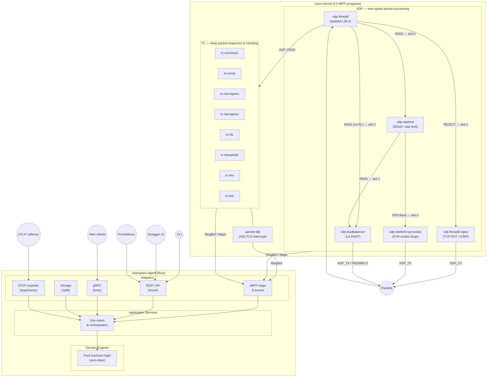

# eBPFsentinel

Kernel-native **Network Detection & Response (NDR)** platform for Linux. One Rust binary replaces your firewall, IDS/IPS, DDoS mitigation, DLP, and 10+ other network security tools — all running inside the Linux kernel via eBPF at wire speed. Not an endpoint agent — a **network agent** that runs where your traffic flows.

## What it does

### Network Security & Control

| Feature | What it does |
|---------|-------------|
| **DDoS Mitigation** | XDP-speed SYN cookie validation, UDP/ICMP/TCP flood detection, volumetric attack mitigation, per-country thresholds, automatic CIDR blocking — drops attacks before they reach the TCP stack |
| **Stateful Firewall** | L3/L4 kernel-side filtering with connection tracking, GeoIP blocking, security zones, VLAN/QinQ support, schedule-based rules, full IPv4/IPv6 dual-stack |
| **L7 Filtering** | Protocol-aware rules for HTTP, TLS/SNI, gRPC, SMTP, FTP, SMB with GeoIP source/destination matching |
| **L4 Load Balancer** | TCP/UDP/TLS passthrough with round-robin, weighted, IP hash, and least-connections algorithms |
| **Traffic Shaping (QoS)** | Bandwidth limits, delay/loss simulation, weighted fair queuing, per-flow token buckets, EDT pacing, FQ-CoDel AQM |
| **Rate Limiting** | Four algorithms (token bucket, fixed window, sliding window, leaky bucket), kernel-side per-country tiers |
| **NAT** | SNAT, DNAT, masquerade, port forwarding, 1:1 NAT, NPTv6 prefix translation, hairpin NAT |
| **Connection Tracking** | Kernel-side TCP/UDP/ICMP state machine, bidirectional flow tracking, timeout policies, flood thresholds |
| **Traffic Normalization** | TTL normalization, MSS clamping, TCP flag/timestamp scrubbing, IP ID randomization, DF/ECN/DSCP rewriting |
| **Policy Routing** | Multi-gateway selection with ICMP/TCP health checks, automatic failover, geographic preference |
| **Zone Segmentation** | Network zones with inter-zone isolation policies — DMZ, LAN, WAN with per-zone rule scoping |
| **Interface Groups** | Named groups of interfaces for multi-NIC rule scoping with bitmask matching and inversion (`!group`) |
| **IP/Port Aliases** | Named alias objects (host, network, GeoIP, dynamic DNS) reusable across firewall, IPS, and DDoS rules |
| **VLAN / QinQ** | 802.1Q and 802.1ad double-tagging support across firewall, IDS, threat intel, and rate limiting |
| **IPv6 Dual-Stack** | Full parity across all engines: separate V4/V6 maps, 128-bit addresses, NDP-aware, NPTv6 |

### Threat Detection & Response

| Feature | What it does |
|---------|-------------|
| **IDS / IPS** | Kernel-side pattern matching with automatic blocking — detects and blocks, not just alerts |
| **Threat Intelligence** | Plug any OSINT feed (CSV, JSON, plaintext, STIX 2.1) — real-time IOC matching, auto-blocking, no vendor lock-in |
| **DLP** | Inspects TLS traffic for PCI card numbers, PII, and credential patterns via uprobe interception |
| **DNS Security** | Passive DNS capture, domain blocklists, behavioral reputation scoring, DNS-enriched alerts |
| **MITRE ATT&CK Mapping** | Every alert tagged with tactic + technique ID — ready for SOC dashboards and SIEM correlation |
| **JA4+ Fingerprinting** | TLS client fingerprinting for detecting C2, malware, and anomalous connections |
| **GeoIP Enforcement** | MaxMind-backed country resolution shared across all engines: DDoS auto-block, IPS subnet injection, rate-limit tiers, L7 filtering |
| **Automated Response** | Response policies with conditions (severity, component) and actions (block IP, webhook, alert escalation) |

### Operations

| Feature | What it does |
|---------|-------------|
| **Hot Reload** | Update rules, modes, and enabled flags without restart. Dynamically loads/unloads eBPF kernel programs when features are toggled. XDP tail-call chain auto-rewires. Triggered by file watcher, SIGHUP, or API |
| **REST API** | OpenAPI 3.0 with Swagger UI and SecurityScheme — all domains covered |
| **gRPC Streaming** | Real-time alert subscriptions with severity, component, and MITRE ATT&CK filters |
| **Prometheus Metrics** | Per-domain counters, histograms, kernel-side eBPF counters, and system-level tracking |
| **OTLP Export** | Alerts as OpenTelemetry Logs (gRPC or HTTP) to any OTLP-compatible collector |
| **Alert Pipeline** | Routing to email, webhook, log, and OTLP sinks with deduplication and throttling |
| **Audit Trail** | Rule change history with before/after diff, actor tracking, and persistent storage |
| **Packet Capture** | Ring-buffer based packet capture with BPF filters for forensic analysis |
| **CLI** | 18+ domain subcommands covering all endpoints with `--output table\|json` and `--token` auth |
| **Authentication** | JWT (RS256), OIDC (JWKS auto-refresh), and API keys with role-based access (Admin, Operator, Viewer) |
| **TLS 1.3** | REST and gRPC endpoints secured with rustls + aws_lc_rs, post-quantum ready (X25519MLKEM768) |
| **Binary Integrity** | SHA-256 + Ed25519 self-verification of the agent binary at startup |

## Architecture


```mermaid
flowchart TB
    subgraph kernel["Linux Kernel (14 eBPF programs)"]
        direction TB
        subgraph xdp["XDP — wire-speed packet processing"]
            fw["xdp-firewall\n(stateful L3/L4)"]
            fw_rej["xdp-firewall-reject\n(TCP RST / ICMP)"]
            rl["xdp-ratelimit\n(DDoS / rate limit)"]
            rl_sc["xdp-ratelimit-syncookie\n(SYN cookie forge)"]
            lb["xdp-loadbalancer\n(L4 DNAT)"]
        end
        subgraph tc["TC — deep packet inspection & rewriting"]
            ct[tc-conntrack]
            scrub[tc-scrub]
            nat_i[tc-nat-ingress]
            nat_e[tc-nat-egress]
            ids[tc-ids]
            ti[tc-threatintel]
            dns[tc-dns]
            qos[tc-qos]
        end
        uprobe["uprobe-dlp\n(SSL/TLS intercept)"]
    end

    packets(("Packets")) --> fw

    fw -- "PASS → slot 0" --> rl
    fw -- "REJECT → slot 1" --> fw_rej
    fw -- "PASS (no RL) → slot 2" --> lb
    rl -- "SYN flood → slot 0" --> rl_sc
    rl -- "PASS → slot 1" --> lb
    fw_rej -- "XDP_TX" --> packets
    rl_sc -- "XDP_TX" --> packets
    lb -- "XDP_TX / REDIRECT" --> packets

    fw -- "XDP_PASS" --> tc
    tc --- uprobe

    subgraph agent["Userspace Agent (Rust)"]
        direction LR
        subgraph domain["Domain Engines"]
            de["Pure business logic\n(zero deps)"]
        end
        subgraph app["Application Services"]
            as["Use cases\n& orchestration"]
        end
        subgraph adapters["Adapters"]
            ebpf_a["eBPF maps\n& events"]
            http["REST API\n(Axum)"]
            grpc["gRPC\n(tonic)"]
            store["Storage\n(redb)"]
            otlp["OTLP exporter\n(logs/traces)"]
        end
    end

    xdp -- "RingBuf / Maps" --> ebpf_a
    tc -- "RingBuf / Maps" --> ebpf_a
    uprobe -- "RingBuf" --> ebpf_a

    ebpf_a --> as
    as --> de
    http --> as
    grpc --> as
    store --> as

    cli(("CLI")) --> http
    swagger(("Swagger UI")) --> http
    prom(("Prometheus")) --> http
    alerts(("Alert clients")) --> grpc
    otel(("OTLP collector")) --> otlp
    otlp --> as
```

## Quick start

**Requirements:** Linux kernel 6.6+ with BTF, Rust stable + nightly

```bash
# Build
cargo build --release
cargo xtask ebpf-build

# Run
sudo ./target/release/ebpfsentinel-agent --config config/ebpfsentinel.yaml
```

Or with Docker:

```bash
docker run --privileged --network host \
  -v ./config:/etc/ebpfsentinel \
  ghcr.io/ebpfsentinel/ebpfsentinel:latest
```

Minimal configuration — only the interface is required:

```yaml
agent:
  interfaces: [eth0]
```

See the [Getting Started guide](https://github.com/ebpfsentinel/ebpfsentinel-docs/blob/main/getting-started/quickstart.md) for detailed setup instructions.

## Documentation

Full documentation is available at [ebpfsentinel/ebpfsentinel-docs](https://github.com/ebpfsentinel/ebpfsentinel-docs):

| Section | Description |
| ------- | ----------- |
| [Getting Started](https://github.com/ebpfsentinel/ebpfsentinel-docs/blob/main/getting-started/quickstart.md) | Installation, prerequisites, first run |
| [Features](https://github.com/ebpfsentinel/ebpfsentinel-docs/blob/main/features/overview.md) | Detailed feature guides (firewall, IDS, DLP, ...) |
| [Configuration](https://github.com/ebpfsentinel/ebpfsentinel-docs/blob/main/configuration/overview.md) | YAML reference for all sections |
| [Architecture](https://github.com/ebpfsentinel/ebpfsentinel-docs/blob/main/architecture/overview.md) | Hexagonal/DDD design, eBPF pipeline, data flow |
| [Kernel Reference](https://github.com/ebpfsentinel/ebpfsentinel-docs/blob/main/kernel/overview.md) | eBPF programs, maps, helpers, pipeline |
| [Hot Reload](https://github.com/ebpfsentinel/ebpfsentinel-docs/blob/main/operations/hot-reload.md) | Dynamic eBPF program loading/unloading |
| [REST API](https://github.com/ebpfsentinel/ebpfsentinel-docs/blob/main/api-reference/rest-api.md) | All endpoints with request/response formats |
| [gRPC API](https://github.com/ebpfsentinel/ebpfsentinel-docs/blob/main/api-reference/grpc-api.md) | Alert streaming service |
| [CLI Reference](https://github.com/ebpfsentinel/ebpfsentinel-docs/blob/main/cli-reference/index.md) | All commands and options |
| [Prometheus Metrics](https://github.com/ebpfsentinel/ebpfsentinel-docs/blob/main/api-reference/prometheus-metrics.md) | Metric names and labels |
| [Deployment](https://github.com/ebpfsentinel/ebpfsentinel-docs/blob/main/operations/deployment/docker.md) | Docker, Kubernetes, binary |
| [Security](https://github.com/ebpfsentinel/ebpfsentinel-docs/blob/main/architecture/security-model.md) | TLS, auth, hardening |
| [Development](https://github.com/ebpfsentinel/ebpfsentinel-docs/blob/main/development/building.md) | Building, testing, contributing |
| [Examples](https://github.com/ebpfsentinel/ebpfsentinel-docs/blob/main/examples/index.md) | Real-world deployment scenarios |

Per-feature configuration examples are in [`config/examples/`](config/examples/).

## Compatibility

- **OS:** Linux only (kernel 6.6+ with BTF)
- **Distros:** Debian 12+, Ubuntu 24.04+ (or 22.04 HWE), RHEL 9.4+, Fedora 37+, Alpine 3.18+, Arch, NixOS, Talos
- **Arch:** x86_64 (primary), aarch64 (cross-tested)
- **Runtime:** Docker, Podman, Kubernetes (DaemonSet), Nomad

See [Compatibility](https://github.com/ebpfsentinel/ebpfsentinel-docs/blob/main/operations/compatibility.md) for the full matrix.

## OSS vs Enterprise

The open-source agent includes all security domains, APIs, CLI, authentication, and observability. An enterprise version adds ML anomaly detection, multi-tenancy, advanced DLP, SIEM integration, compliance reporting, HA clustering, multi-cluster federation, advanced RBAC, air-gap support, analytics dashboards, fleet management, AI/LLM security, TLS intelligence, network forensics, and automated response orchestration. See [Enterprise Features](https://github.com/ebpfsentinel/ebpfsentinel-docs/blob/main/features/enterprise/overview.md) for details.

## License

GNU Affero General Public License v3.0 — see [LICENSE](LICENSE).
