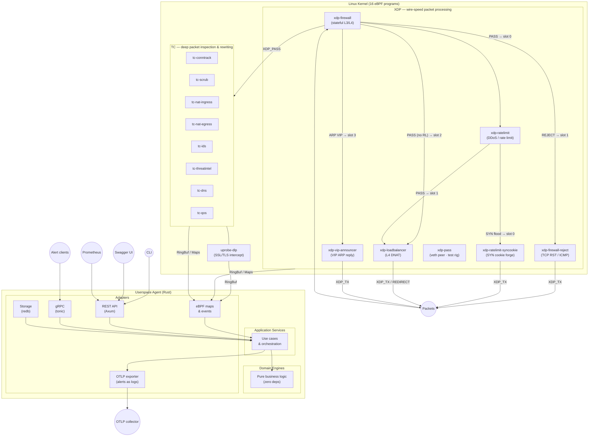

# eBPFsentinel

<p align="center">
  
</p>

A unified, kernel-native **Network & Security platform** for Linux — one Rust binary that replaces your firewall, IDS/IPS, DDoS mitigation, DLP, and 10+ more tools, all running in-kernel via eBPF at wire speed. Not an endpoint agent — it enforces security inline, right where your traffic flows.

## Why eBPFsentinel

- **One agent, not a stack.** Firewall, IDS/IPS, DDoS, DLP, threat intel, NAT, and QoS normally mean a rack of appliances or a pile of daemons — each with its own config, parser, and packet copy. eBPFsentinel runs them as a single binary sharing one kernel pipeline: less to deploy, less to patch, less attack surface.
- **In-kernel, at the source.** Programs attach at XDP/TC/uprobe hook points, so traffic is inspected and dropped in the kernel — no packet copy to userspace on the fast path, no sidecar hop. Malicious traffic dies on the wire instead of costing you CPU upstack.
- **Network placement, not endpoint sprawl.** It runs where traffic flows — host NIC, node boundary — not as an agent on every workload. One enforcement point per node sees east-west and north-south alike, with no per-app instrumentation.
- **Built for trust.** Pure Rust with `#![forbid(unsafe_code)]` across the domain and application layers and a hexagonal/DDD design. It runs **rootless** via BPF token delegation — zero `CAP_BPF` / `CAP_NET_ADMIN` — and tags every alert with MITRE ATT&CK for your SIEM.

## What it does

A snapshot of the capabilities below — see the [Features guide](https://github.com/ebpfsentinel/ebpfsentinel-docs/blob/main/features/overview.md) for the full reference on each engine.

### Network Security & Control

| Feature | Summary |
|---------|---------|
| **DDoS Mitigation** | XDP-speed SYN cookies + flood detection, drops attacks before the TCP stack |
| **Stateful Firewall** | L3/L4 filtering with conntrack, GeoIP, zones, VLAN/QinQ, IPv4/IPv6 |
| **L7 Filtering** | Protocol-aware rules for HTTP, TLS/SNI, gRPC, SMTP, FTP, SMB |
| **L4 Load Balancer** | TCP/UDP/TLS passthrough with four balancing algorithms |
| **Traffic Shaping (QoS)** | Bandwidth limits, fair queuing, EDT pacing, FQ-CoDel AQM |
| **Rate Limiting** | Four algorithms with kernel-side per-country tiers |
| **NAT** | SNAT, DNAT, masquerade, port forwarding, 1:1, NPTv6, hairpin |
| **Connection Tracking** | Kernel-side TCP/UDP/ICMP state machine with timeout policies |
| **Traffic Normalization** | TTL/MSS/flag scrubbing, IP ID randomization, DSCP rewriting |
| **Policy Routing** | Multi-gateway with health checks and automatic failover |
| **Zone Segmentation** | Network zones (DMZ/LAN/WAN) with inter-zone isolation |
| **Interface Groups** | Named NIC groups for multi-NIC rule scoping |
| **IP/Port Aliases** | Reusable named objects across firewall, IPS, and DDoS rules |
| **VLAN / QinQ** | 802.1Q and 802.1ad double-tagging across engines |
| **IPv6 Dual-Stack** | Full V4/V6 parity, NDP-aware, NPTv6 |

### Threat Detection & Response

| Feature | Summary |
|---------|---------|
| **IDS / IPS** | Kernel-side pattern matching with automatic blocking |
| **Threat Intelligence** | Any OSINT feed (CSV, JSON, STIX 2.1) with real-time IOC matching |
| **DLP** | TLS inspection for PCI, PII, and credential patterns via uprobe |
| **DNS Security** | Passive capture, blocklists, behavioral reputation scoring |
| **MITRE ATT&CK Mapping** | Every alert tagged with tactic + technique ID |
| **JA4+ Fingerprinting** | TLS client fingerprinting for C2 and malware detection |
| **GeoIP Enforcement** | MaxMind country resolution shared across all engines |
| **Automated Response** | Condition-based policies (block IP, webhook, escalation) |

### Operations

| Feature | Summary |
|---------|---------|
| **Hot Reload** | Update rules and toggle eBPF programs without restart |
| **REST API** | OpenAPI 3.0 with Swagger UI, all domains covered |
| **gRPC Streaming** | Real-time alert subscriptions with severity/component filters |
| **Prometheus Metrics** | Per-domain and kernel-side eBPF counters |
| **OTLP Export** | Alerts as OpenTelemetry Logs (gRPC or HTTP) |
| **Alert Pipeline** | Routing to email, webhook, log, OTLP with dedup + throttling |
| **Audit Trail** | Rule change history with before/after diff and actor tracking |
| **Packet Capture** | Ring-buffer capture with BPF filters for forensics |
| **CLI** | 18+ subcommands with `--output table\|json` and `--token` auth |
| **Authentication** | JWT, OIDC, and API keys with role-based access |
| **TLS 1.3** | rustls + aws_lc_rs, post-quantum ready (X25519MLKEM768) |

## Architecture


```mermaid
flowchart TB
    subgraph kernel["Linux Kernel (16 eBPF programs)"]
        direction TB
        subgraph xdp["XDP — wire-speed packet processing"]
            fw["xdp-firewall\n(stateful L3/L4)"]
            fw_rej["xdp-firewall-reject\n(TCP RST / ICMP)"]
            rl["xdp-ratelimit\n(DDoS / rate limit)"]
            rl_sc["xdp-ratelimit-syncookie\n(SYN cookie forge)"]
            lb["xdp-loadbalancer\n(L4 DNAT)"]
            vip["xdp-vip-announcer\n(VIP ARP reply)"]
            pass["xdp-pass\n(veth peer · test rig)"]
        end
        subgraph tc["TC — deep packet inspection & rewriting"]
            ct[tc-conntrack]
            scrub[tc-scrub]
            nat_i[tc-nat-ingress]
            nat_e[tc-nat-egress]
            ids[tc-ids]
            ti[tc-threatintel]
            dns[tc-dns]
            qos[tc-qos]
        end
        uprobe["uprobe-dlp\n(SSL/TLS intercept)"]
    end

    packets(("Packets")) --> fw

    fw -- "PASS → slot 0" --> rl
    fw -- "REJECT → slot 1" --> fw_rej
    fw -- "PASS (no RL) → slot 2" --> lb
    fw -- "ARP VIP → slot 3" --> vip
    rl -- "SYN flood → slot 0" --> rl_sc
    rl -- "PASS → slot 1" --> lb
    fw_rej -- "XDP_TX" --> packets
    rl_sc -- "XDP_TX" --> packets
    lb -- "XDP_TX / REDIRECT" --> packets
    vip -- "XDP_TX" --> packets

    fw -- "XDP_PASS" --> tc
    tc --- uprobe

    subgraph agent["Userspace Agent (Rust)"]
        direction LR
        subgraph domain["Domain Engines"]
            de["Pure business logic\n(zero deps)"]
        end
        subgraph app["Application Services"]
            as["Use cases\n& orchestration"]
        end
        subgraph adapters["Adapters"]
            ebpf_a["eBPF maps\n& events"]
            http["REST API\n(Axum)"]
            grpc["gRPC\n(tonic)"]
            store["Storage\n(redb)"]
            otlp["OTLP exporter\n(alerts as logs)"]
        end
    end

    xdp -- "RingBuf / Maps" --> ebpf_a
    tc -- "RingBuf / Maps" --> ebpf_a
    uprobe -- "RingBuf" --> ebpf_a

    ebpf_a --> as
    as --> de
    http --> as
    grpc --> as
    store --> as

    cli(("CLI")) --> http
    swagger(("Swagger UI")) --> http
    prom(("Prometheus")) --> http
    alerts(("Alert clients")) --> grpc
    as --> otlp
    otlp --> otel(("OTLP collector"))
```

## Quick start

**Requirements:** Linux kernel 6.9+ on x86_64 or aarch64, with BTF (`CONFIG_DEBUG_INFO_BTF=y`). The 6.9 floor unlocks **BPF token delegation** — the agent loads its eBPF programs with zero `CAP_BPF` / `CAP_NET_ADMIN` (rootless).

### Install (prebuilt)

Grab the latest tarball for your architecture from the [releases page](https://github.com/ebpfsentinel/ebpfsentinel/releases) — it ships the agent, prebuilt eBPF objects, a systemd unit, and an `install.sh`:

```bash
tar xzf ebpfsentinel-<version>-linux-x86_64.tar.gz
cd ebpfsentinel-<version>-linux-x86_64
sudo ./install.sh            # installs to /usr/local, wires up the systemd unit
```

### Build from source

The userspace agent builds on **stable**; the eBPF kernel programs need the **nightly** toolchain (driven by `cargo xtask`, `bpfel` target). Install Rust via [rustup](https://rustup.rs):

```bash
cargo build --release        # agent + token launcher (stable)
cargo xtask ebpf-build        # eBPF programs (nightly)

# eBPF loads only through a BPF token (a user-namespace feature). The launcher
# sets up the delegated bpffs in a child user namespace and execs the agent
# there — this brief bootstrap is the one step that needs CAP_SYS_ADMIN.
sudo ./target/release/ebpfsentinel-token-launch \
  --bpffs /sys/fs/bpf/ebpfsentinel \
  ./target/release/ebpfsentinel-agent --config config/ebpfsentinel.yaml
```

### Docker (rootless)

The agent loads eBPF **exclusively** through a BPF token (kernel 6.9+) — never `CAP_BPF`, never `--privileged`. The image entrypoint is the `ebpfsentinel-token-launch` launcher: as root it mounts the delegated bpffs in a child user namespace, then execs the agent there, unprivileged. `docker compose up` wires this automatically. To run it by hand:

```bash
# Optional: to override the config, bind-mount it root-owned and not
# world-readable (the agent rejects mode 0644); omit the -v line to use the
# image's baked-in default.
#   sudo chown root:root config/ebpfsentinel.yaml && sudo chmod 640 config/ebpfsentinel.yaml
docker run --network host \
  --cap-add SYS_ADMIN --cap-add NET_RAW \
  --security-opt apparmor=unconfined \
  -v ./config/ebpfsentinel.yaml:/etc/ebpfsentinel/config.yaml \
  ghcr.io/ebpfsentinel/ebpfsentinel:latest
```

`CAP_SYS_ADMIN` is held only by the brief launcher bootstrap (bpffs delegation + user-namespace creation), not by the long-running agent. `CAP_NET_RAW` lets the launcher pre-open the `AF_PACKET` sockets for rootless packet capture (it is in Docker's default set anyway). See the [BPF token guide](https://github.com/ebpfsentinel/ebpfsentinel-docs/blob/main/operations/deployment/bpf-token.md) for the systemd and Kubernetes paths and the full capability matrix.

### Minimal config

Only the interface is required:

```yaml
agent:
  interfaces: [eth0]
```

### Verify it's running

```bash
curl http://127.0.0.1:8080/healthz     # liveness probe (no auth)
ebpfsentinel-agent status              # agent + per-engine status
```

See the [Getting Started guide](https://github.com/ebpfsentinel/ebpfsentinel-docs/blob/main/getting-started/quickstart.md) for detailed setup instructions.

## Documentation

Full documentation is available at [ebpfsentinel/ebpfsentinel-docs](https://github.com/ebpfsentinel/ebpfsentinel-docs):

| Section | Description |
| ------- | ----------- |
| [Getting Started](https://github.com/ebpfsentinel/ebpfsentinel-docs/blob/main/getting-started/quickstart.md) | Installation, prerequisites, first run |
| [Features](https://github.com/ebpfsentinel/ebpfsentinel-docs/blob/main/features/overview.md) | Detailed feature guides (firewall, IDS, DLP, ...) |
| [Configuration](https://github.com/ebpfsentinel/ebpfsentinel-docs/blob/main/configuration/overview.md) | YAML reference for all sections |
| [Architecture](https://github.com/ebpfsentinel/ebpfsentinel-docs/blob/main/architecture/overview.md) | Hexagonal/DDD design, eBPF pipeline, data flow |
| [Kernel Reference](https://github.com/ebpfsentinel/ebpfsentinel-docs/blob/main/kernel/overview.md) | eBPF programs, maps, helpers, pipeline |
| [Hot Reload](https://github.com/ebpfsentinel/ebpfsentinel-docs/blob/main/operations/hot-reload.md) | Dynamic eBPF program loading/unloading |
| [REST API](https://github.com/ebpfsentinel/ebpfsentinel-docs/blob/main/api-reference/rest-api.md) | All endpoints with request/response formats |
| [gRPC API](https://github.com/ebpfsentinel/ebpfsentinel-docs/blob/main/api-reference/grpc-api.md) | Alert streaming service |
| [CLI Reference](https://github.com/ebpfsentinel/ebpfsentinel-docs/blob/main/cli-reference/index.md) | All commands and options |
| [Prometheus Metrics](https://github.com/ebpfsentinel/ebpfsentinel-docs/blob/main/api-reference/prometheus-metrics.md) | Metric names and labels |
| [Deployment](https://github.com/ebpfsentinel/ebpfsentinel-docs/blob/main/operations/deployment/docker.md) | Docker, Kubernetes, binary |
| [Security](https://github.com/ebpfsentinel/ebpfsentinel-docs/blob/main/architecture/security-model.md) | TLS, auth, hardening |
| [Development](https://github.com/ebpfsentinel/ebpfsentinel-docs/blob/main/development/building.md) | Building, testing, contributing |
| [Examples](https://github.com/ebpfsentinel/ebpfsentinel-docs/blob/main/examples/index.md) | Real-world deployment scenarios |

Per-feature configuration examples are in [`config/examples/`](config/examples/).

## Compatibility

- **OS:** Linux only (kernel 6.9+ with BTF)
- **Distros:** Debian 12+, Ubuntu 24.04+ (or 22.04 HWE), RHEL 10+, Fedora 40+, Alpine edge, Arch, NixOS, Talos
- **Arch:** x86_64 (primary), aarch64 (cross-tested)
- **Runtime:** Docker, Podman, Kubernetes (DaemonSet), Nomad

See [Compatibility](https://github.com/ebpfsentinel/ebpfsentinel-docs/blob/main/operations/compatibility.md) for the full matrix.

## OSS vs Enterprise

The **open-source agent** is fully functional on its own: every security domain shown above, plus the REST/gRPC APIs, CLI, authentication, and observability. Nothing in the core is paywalled.

The **enterprise edition** layers on capabilities for fleets and regulated environments:

| Area | Enterprise adds |
| ---- | --------------- |
| Detection | ML anomaly detection (Z-score, EWMA, CUSUM, ONNX, DGA, C2 beaconing, TLS clustering), AI/LLM security, TLS intelligence, network forensics |
| L7 deep inspection | Extended protocol parsers (MQTT, AMQP, NATS, Cassandra), content inspection (SQLi/XSS/injection signatures), per-protocol policies (Redis/Mongo/Kafka/SQL/LDAP/SSH), alert enrichment (OWASP/MITRE/PCI), extended TLS-library hooking |
| Data protection | Advanced DLP (Vectorscan engine, custom patterns, block mode) |
| Operations | HA clustering, multi-cluster federation, fleet management, air-gap mode |
| Multi-tenancy & access | Multi-tenancy (isolation + quotas), advanced RBAC, advanced analytics & reports |
| Integration & response | SIEM integration (10 connectors), automated response orchestration (SOAR) |
| Compliance | Compliance reports (PCI-DSS 4, HIPAA, GDPR, SOC 2, NIS2, DORA, SecNumCloud, HDS) |
| Licensing & integrity | Ed25519 + ML-DSA-65 dual-signed keys, machine fingerprint binding, air-gap activation, SHA-256 + Ed25519 binary self-verification at startup |

A CRD-driven Kubernetes operator and a web dashboard UI complement the agent. See [Enterprise Features](https://github.com/ebpfsentinel/ebpfsentinel-docs/blob/main/features/enterprise/overview.md) for the full list and per-feature detail.

## License

GNU Affero General Public License v3.0 — see [LICENSE](LICENSE).
